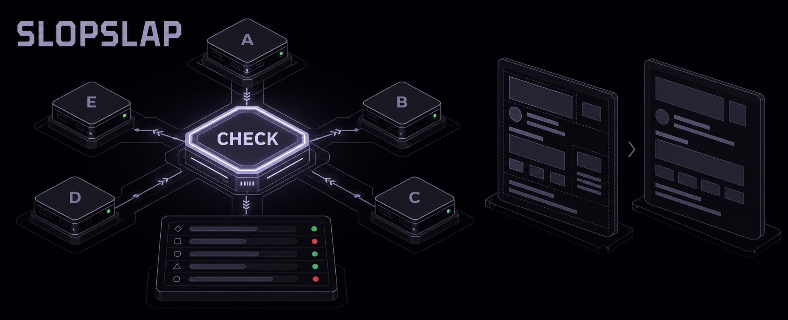
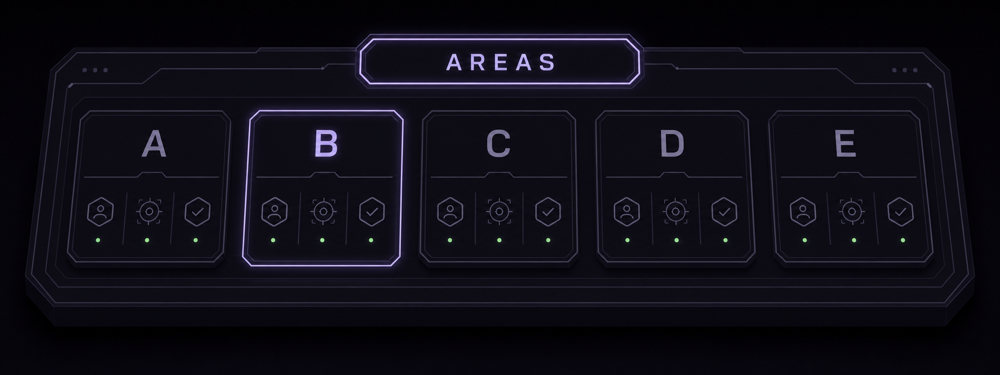
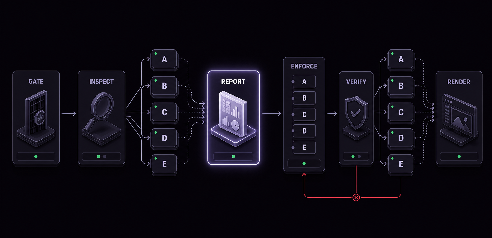
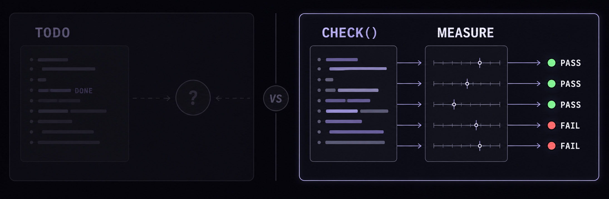
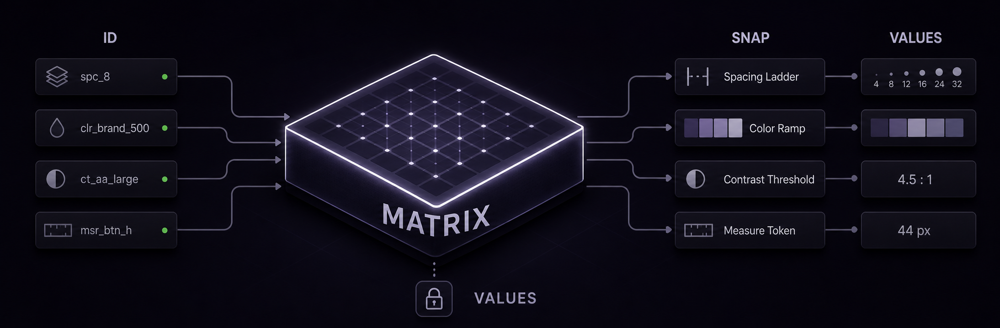
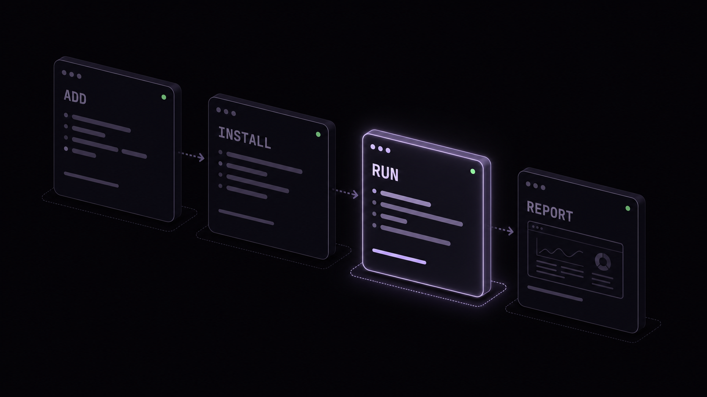
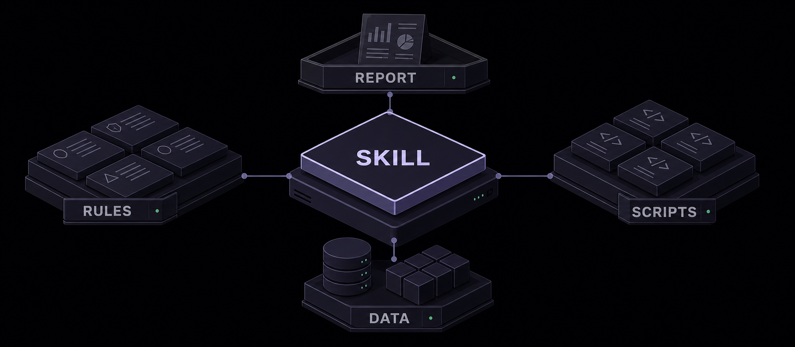

> **Slap the slop out of your UI.** — a Claude Code plugin by [vibedesignlab](https://vibedesignlab.net)

AI가 짠 UI, 어딘가 촌스러운데 정확히 뭐가 문제인지 짚어내기 어려울 때가 있다. 반사적 오버라인, 규율 없는 그리드, 과밀한 간격, 장식 이탤릭, 무지개 팔레트 — 흔한 슬롭 신호는 대개 이 다섯 가지로 좁혀진다. slopslap 은 문답 없이 병렬 점검 파이프라인으로 그 신호를 걷어낸다.

## The Areas



- **A · 오버라인** — 제목마다 반사적으로 붙는 소형 라벨 남발
- **B · 레이아웃·컨테이너·폭** — 규율 없는 그리드, 고정 px, 컨테이너 남발
- **C · 간격** — 과밀·관성 간격, 죽은 여백
- **D · 타이포** — 장식 이탤릭, 근거 없는 스케일
- **E · 색** — 근거 없는 무지개 팔레트

## The Trial



| 단계 | 내용 |
|---|---|
| **0. 선행 판정** | 콘텐츠 상수화 + BOLD 게이트 판정 → 플래그로 하류 전달 |
| **1. 병렬 정적 점검** | A~E 5개 영역 동시 점검 → `findings-<X>.md`, 항목마다 `check` 술어 |
| **2. 리포트** | findings 합본 HTML + 로컬 링크 발행 |
| **3. 순차 집행** | A→B→C→D→E 순서로 `check` 미충족 항목만 수정, 교체형 텔은 레퍼런스 값에 snap |
| **4. 병렬 재점검** | 같은 `check` 재실측 → 누락 시 해당 영역만 재집행 |
| **5. 렌더 1회** | before/after 헤드리스 캡처로 체감 확인 |

## The Difference



다른 도구는 "완료" 텍스트를 그대로 믿는다. slopslap 은 안 믿는다. findings 의 각 항목은 상태 문구가 아니라 소스에서 참/거짓을 실측하는 `check` 술어이고, 집행과 재점검은 매번 그 술어를 다시 계산한다 — 오기록에 속아 넘어가는 실패를 구조적으로 차단한다.

## The Reference



수정값은 지어내지 않는다. 교체형 텔(간격·타입·팔레트·대비)은 실제 외부 소스에서 나온다.

- **정량 코퍼스**: taxonomy-id 로 조인되는 무키·무료 레퍼런스 — Tailwind 간격·Radix 팔레트·WCAG 대비 임계를 실제 npm 패키지에서 생성(`gen-reference-data.mjs`, 손 타이핑 아님). 삭제형 텔은 "차용값 없음"으로 표기.
- **transform 모드**: 규율 있는 de-slop 을 넘어 과감히 바꾸고 싶을 때. 실제 우수 사이트를 헤드리스 렌더해 실측한 contract(팔레트·타입스케일·간격) 매트릭스에서, 대상의 콘텐츠·컨셉으로 styleTag 방향을 도출해 전 영역이 **한 방향으로** 전환한다. 차용은 값만 — 카피·정보·순서·레이아웃 콘텐츠는 불가침. 스타일이 다른 두 대상은 서로 다른 결과가 나와야 한다(median 가드).

## Install



Claude Code 에서 세 줄이면 끝:
```
/plugin marketplace add vibedesignlab/slopslap
/plugin install slopslap@vibedesignlab
/slopslap
```
로컬에서 직접 실행하려면: `claude --plugin-dir .` (또는 이 폴더에서 Claude Code 를 열면 `/slopslap` 자동 등록).

업데이트: `/plugin update slopslap@vibedesignlab` · 배포·경로 치환(`${CLAUDE_PLUGIN_ROOT}`) 절차는 **[DEPLOY.md](DEPLOY.md)** 참조.

## Principles

- **컨텍스트 드롭 방지**: 영역별 서브에이전트 격리 + findings 파일 외부화로, 한 에이전트가 전 규칙을 들면 생기는 조용한 누락을 막는다.
- **점검표 = 평가 함수**: findings 는 상태가 아니라 매번 소스 실측하는 `check` 술어다.
- **상류 단일 판정**: 콘텐츠 상수화·BOLD 게이트는 0단계에서 한 번만 판정하고, 하류는 플래그만 소비한다.
- **값은 도출**: 고정 px 금지 — 간격은 base × 고정 배수, 폭은 단일 measure 토큰에서 도출한다.
- **레퍼런스 차용(값만)**: 교체형 텔은 taxonomy-id 로 정량 코퍼스(Tailwind 간격·Radix 팔레트·WCAG 대비, 무키·무료 vendoring)에 결정적 조인해 snap 기준으로 쓴다. 구성·카피는 차용 금지, 프로젝트 자체 토큰이 최우선. 삭제형 텔은 레퍼런스 무관.
- **BOLD 게이트**: 투박한 스타일 ∧ 저밀도일 때만 과감히 키우고, 아니면 순수 슬롭 제거만 한다. 매크로 여백의 무차별 확대는 금지.
- **리덕티브 / transform 2모드**: 기본은 삭제 > 축소 > 교체(재설계 아님). "과감히 바꿔줘" 면 transform 모드로 실측 레퍼런스 방향에 맞춰 일관 전환한다. 어느 모드든 카피·정보·순서는 불가침이다.
- **문제 층위 분리 진단**: 누락 시 규칙 → 점검표 → 집행 → 렌더 4층위로 갈라 원인을 확정한다.
- 스킬은 이 프로젝트에 귀속되며 전역 등록은 아니다. 점검은 정적 계산으로 이뤄지고, 브라우저는 5단계 렌더에서만 쓴다.



<details>
<summary>Repo structure</summary>

```
.claude/skills/slopslap/
  SKILL.md                          # 파이프라인 지휘 (얇은 오케스트레이터)
  references/inspection-areas.md    # 영역별 점검·집행 규칙 SSOT + findings 스키마(check 술어)
scripts/
  scan-slop-signals.mjs             # 택소노미 detect 신호 스캐너 (js/ts/css/html/vue/svelte/astro)
  build-findings-report.mjs         # findings-*.md → 자기완결 HTML 리포트 (레퍼런스 블록 자동 조인)
  fetch-references.mjs              # taxonomy-id → 정량 레퍼런스 조인 CLI (무키·무료·오프라인)
  capture-reference.mjs            # 실사이트 헤드리스 렌더 → 실측 contract 추출 (transform 매트릭스 수집 장비)
  fetch-answer.mjs                 # tell → 레퍼런스 매트릭스 답안 유닛 조회 (transform 모드)
  gen-reference-data.mjs           # 실제 npm 패키지에서 referenceData.js 생성
src/data/
  aiSlopTaxonomyData.js             # AI-slop 택소노미 SSOT (버전·항목 수는 파일 헤더 changelog)
  referenceData.js                  # 텔별 정량 레퍼런스 코퍼스 (실제 Tailwind·Radix·WCAG 패키지에서 생성)
  referenceMatrix/                  # transform 모드: 실측 사이트 contract 16유닛(팔레트·타입·간격) + 스크린샷
```

</details>

---

Made with 🖐️ by [vibedesignlab](https://vibedesignlab.net) · MIT License
